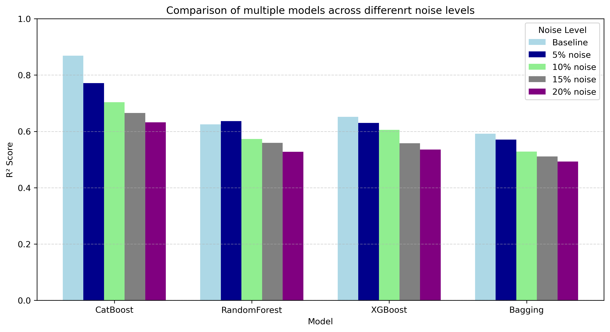

# RUL
In this project, The reamining working capability of a machine has been analysed and modeled to predict for the machine based on the sensor data such as the vibration,temperature and so on. This industrial application of AI models are extremely beneficial in terms of managing the downtime in the factories before any fault acutually occurs, and provides a headstart for the managers to perform maintenance before any fault occurs and it is also useful in saving time,money and effort where it eliminates the extremely early maintenance and provvides exacty how many more cycles are there for a specific machien to go fault. The managers can set a threshold 5, when it triggers a maintenance alarm.

In the following barplot, There are multiple models acrossdifferent noise levels incorporated in the testing data for measuring for the model robustness. This test resulted in the catboost model performing the best in terms of learn the lrger extent of target distribuion where even with noise injection to the test data, the model was able to provide relaible extimation which can also be confirm use the mean absolute error scores of these models.

